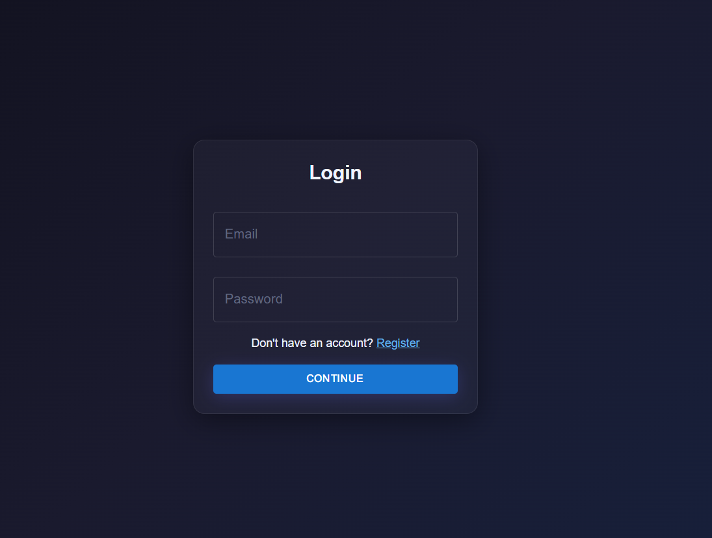
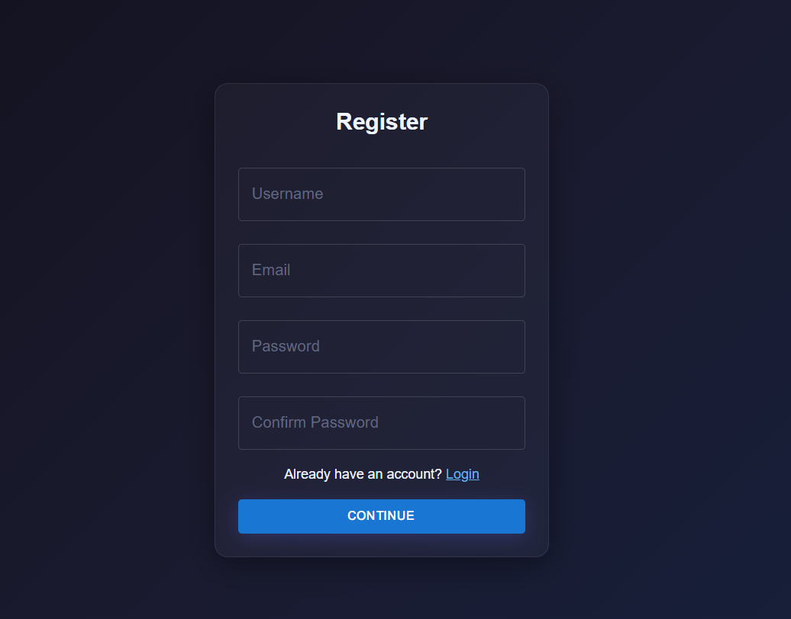
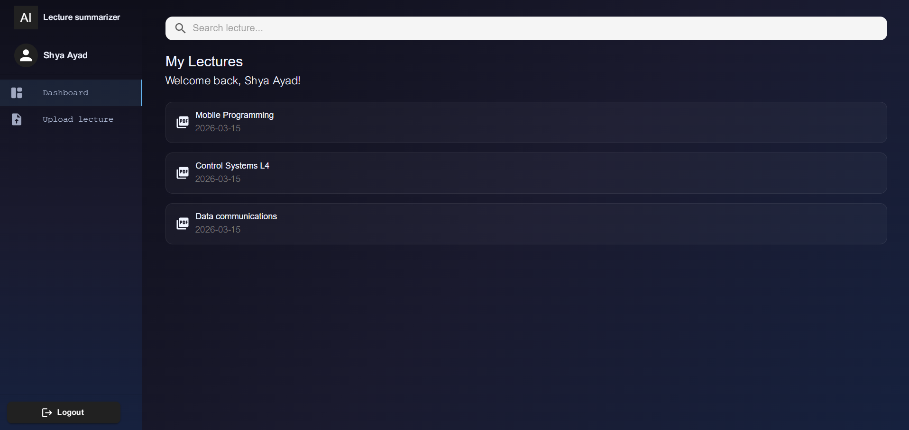
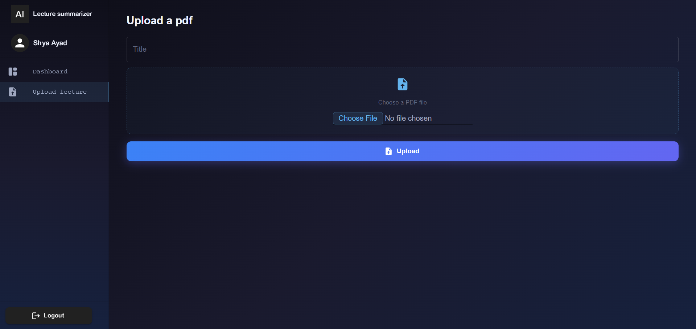
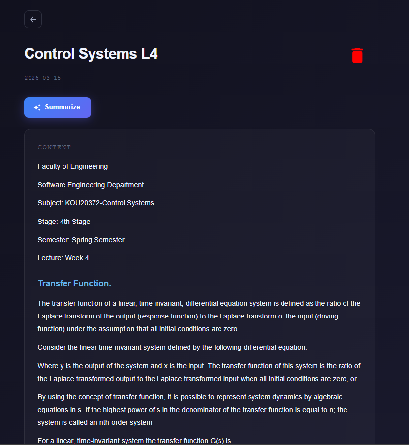
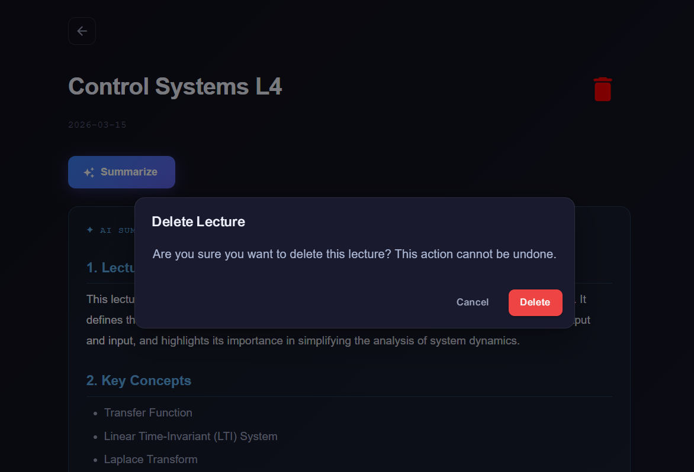
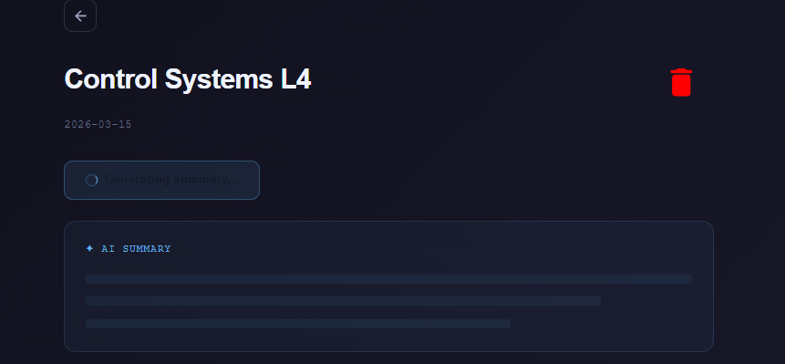
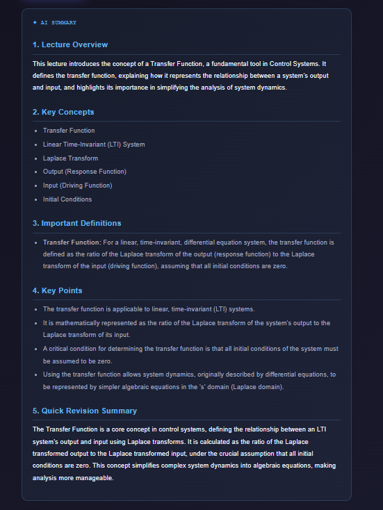

# ClariNote
Your AI-powered assistant that transforms complex PDFs and long texts into clear, concise summaries.

---

## Built with the tools and technologies:


## 🖼️ Screenshots

### Login 


### Register 


### User lectures 


### Upload Lecture


### Lecture content 


### Delete lecture dialog


### Summary generation state


### PDF Summary 


## 📌 Features

- Upload a **PDF lecture file**
- AI automatically analyzes the content
- Generates organized study notes including:
  - **Lecture Overview**
  - **Key Concepts**
  - **Important Definitions**
  - **Key Points**
  - **Quick Revision Summary**

This makes it easier for students to review lectures and prepare for exams efficiently.

---

## ⚙️ Prerequisites

Make sure the following are installed on your machine before running the project:

- **PHP**
- **Poppler** (for PDF text extraction)
- **Composer**
- **Node.js & npm** – for running the frontend
- **MySQL** – database
- **Git** – to clone the repository

---

## 🛠️ Tech Stack

### Backend
- **Laravel** – PHP framework used to build the REST API and handle application logic
- **PHP** – Core programming language for the backend
- **Composer** – Dependency management

### AI Integration
- **Gemini API** – Used to analyze lecture text and generate structured summaries

## 🤖 Automation with n8n

This project integrates **n8n** to enhance functionality through automation.

### 🔹 What it does
- Uses n8n workflows to handle background automation processes  
- Automatically sends an email to the user after their PDF summary has been successfully generated  

### 🔹 Why it matters
- Improves user experience by providing instant feedback  
- Demonstrates real-world use of automation tools in a fullstack application  
- Reduces manual effort by handling communication automatically  
### File Processing
- **Poppler** – Used to extract text content from uploaded PDF files

### Database
- **MySQL** – Stores lecture files, extracted text, and generated summaries

### Tools & Development
- **Postman** – API testing
- **Git & GitHub** – Version control and project hosting

## 🚀 How It Works

1. The user uploads a **PDF lecture file**.
2. The system extracts the **text content** from the PDF.
3. The **AI agent processes the text**.
4. Structured notes are generated automatically for easier studying.

---

## 🎯 Purpose

ClariNote aims to help students save time by converting long lecture materials into **clear, structured summaries** that are easy to understand and revise.

---

## ⚙️ Installation

Follow these steps to run the project locally (Backend + Frontend).

### 1. Clone the Repository

```bash
git clone https://github.com/your-username/clarinote.git
cd backend
```

### 2. Install Dependencies

Use Composer to install the required PHP packages.

```bash
composer install
```

### 3. Configure Environment Variables

Copy the example environment file:

```bash
cp .env.example .env
```

Then generate the application key:

```bash
php artisan key:generate
```

Add your **Gemini API key** to the `.env` file:

```
GEMINI_API_KEY=your_api_key_here
```

### 4. Set Up the Database

Configure your database credentials inside `.env`, then run:

```bash
php artisan migrate
```

### 5. Start the Development Server

Run the Laravel server:

```bash
php artisan serve
```

The application will be available at:

```
http://127.0.0.1:8000
```

### 6. Test the API

You can test the endpoints using **Postman** by sending requests to the running server.

### 7. Setup the Frontend 
Open a new terminal navigate to the frontend folder and install dependencies:
```bash
  cd frontend
  cd ClariNote
  npm install
```
Start the development server:
```bash
npm run dev
```

The frontend will be available at:
```
http://localhost:5173
```